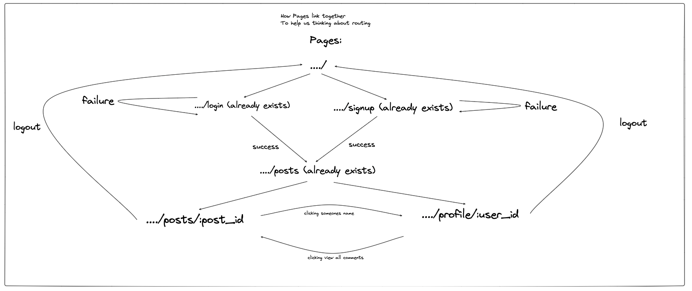
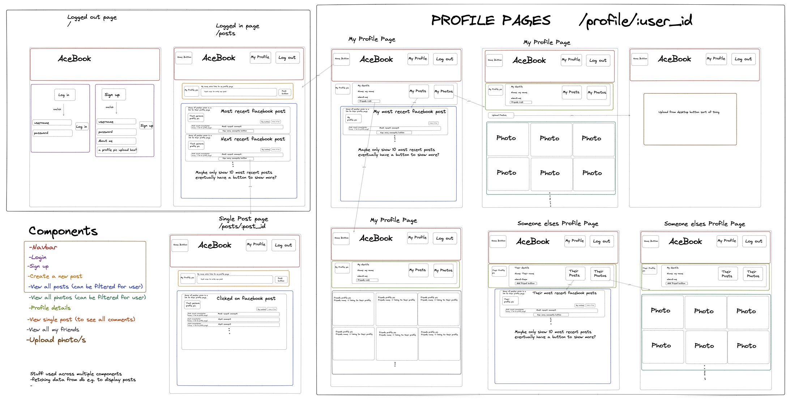

# Acebook

In this project, we were tasked with working on an existing application. A significant part of the challenge was to familiarise ourselves with the codebase we inherited, and work to improve and extend it.

## About this project
Acebook is a web-app similar to Facebook and was built using the MERN stack. It allows users to: sign up and log in; view, create, like and comment on posts. You can also manage your friendslist by creating, rejecting and accepting friend requests as well as deleting friends. Finally, you can update your personal details and choose from a range of profile emojis to suit the user. This was a group project completed during week 8 and 9 of the Makers bootcamp.

## Learnings from this project
Through creating this app in a group environment, we improved our ability to:
- Work and communicate effectively within a software development team
- Break down projects into tasks and assign them to pairs
- Use agile ceremonies to organise work into sprints and improve processes
- Use a developer workflow to plan, implement and peer-review features
- Build fullstack web applications using the MERN stack for the first time
- Implement routes that interact with the MongoDB database provided to us
- Update the user authentication to use bcrypt and validator
- Build out the entirety of the frontend and styly it using react

## Existing Features

It's already possible for a user to:
- Sign up
- Sign in
- Sign out
- View a list of posts

## Architecture

This project was built using the MERN stack.

## Structure and Approach

The initial planning diagram was as follows:



We approached the problem by first understanding the code provided to us. We then created user stories to break down the requirements into smaller, manageable tasks. We then mapped out what each page coud look like and how you ould get from one to another , creating the diagrams above.We then discussed our MVP to kick off our first sprint. We followed an agile process throughout the project with daily standups and retros after each sprint.


## Installation and Running
To install and run the code, you will need to have node and npm installed on your machine. You will need to clone the repository. Then you will need too:
1. Start the server

  **Note the use of an environment variable for the JWT secret**

   ```
   ; cd api
   ; JWT_SECRET=SUPER_SECRET npm start
   ```
2. Start the front end

  In a new terminal session...

  ```
  ; cd frontend
  ; npm start
  ```

You should now be able to open your browser and go to `http://localhost:3000/ to begin using the application.


## Testing
The backend of this application is highly tested using the Jest framework. The frontend has some test coverage using Cypress. To run the tests you need to:
### The Backend (API)

**Note the use of an environment variable for the JWT secret**

  Start the server in test mode (so that it connects to the test DB)

  ```
  ; cd api
  ; JWT_SECRET=SUPER_SECRET npm run start:test
  ```

  Then run the tests in a new terminal session

  ```
  ; cd api
  ; JWT_SECRET=SUPER_SECRET npm run test
  ```

### The frontend (React)

**Note the use of an environment variable for the JWT secret**

  Start the server in test mode (so that it connects to the test DB)

  ```
  ; cd api
  ; JWT_SECRET=SUPER_SECRET npm run start:test
  ```

  Then start the front end in a new terminal session

  ```
  ; cd frontend
  ; JWT_SECRET=SUPER_SECRET npm start
  ```

  Then run the tests in a new terminal session

  ```
  ; cd frontend
  ; JWT_SECRET=SUPER_SECRET npm run test
  ```

## Extensions
The following extensions could improve the application:
- Letting users upload pictures or videos
- Being able to search for users by name or email to find friends to add
